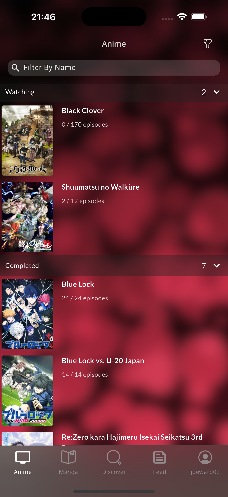
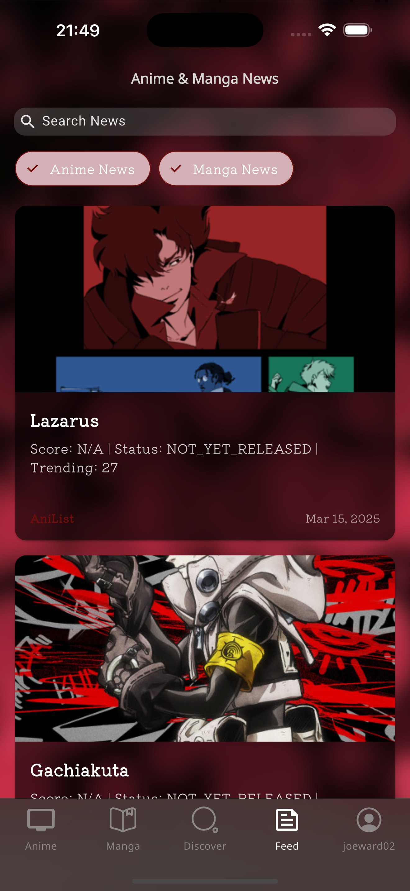

# OtakuWrdd - Flutter Anime & Manga Tracking App

A comprehensive anime and manga tracking application built with Flutter and Firebase, offering users a seamless experience to discover, track, and manage their anime and manga collections.

## Features

📺 **Anime & Manga Tracking**

- Comprehensive anime and manga databases
- Personal watchlist/readlist management
- Episode/chapter tracking
- Rating system
- Favorites collection

🔍 **Discovery System**

- Trending anime and manga
- Seasonal anime listings
- Top-ranked titles
- Genre-based browsing
- Advanced search functionality

👤 **User Management**

- Secure authentication system
- Profile customization
- Watch/read history
- Statistics tracking
- Favorites management

🎨 **Modern UI/UX**

- Responsive design
- Dark theme
- Custom animations
- Character information
- Intuitive navigation

## Technical Stack

### Frontend

- Flutter for cross-platform development
- GetX for state management
- Custom widgets and animations
- Responsive UI components
- Image handling and caching

### Backend

- Firebase Authentication
- Cloud Firestore
- Firebase Storage
- MyAnimeList API integration
- Real-time data synchronization
- Stripe-Payment GateAway

## Getting Started

### Prerequisites

- Flutter (latest version)
- Firebase account
- Stripe
- Android Studio / VS Code
- Git

### Installation

1. Clone the repository

```bash
git clone https://github.com/yourusername/otakuwrdd.git
```

2. Install dependencies

```bash
cd otakuwrdd
flutter pub get
```

3. Configure Firebase

- Create a new Firebase project
- Add Android & iOS apps in Firebase console
- Download and add configuration files
- Enable Authentication methods
- Set up Cloud Firestore rules

4. Configure API Keys

- Create a `.env` file in the root directory
- Add your API keys (MyAnimeList, YouTube, etc.)

5. Run the app

```bash
flutter run
```

## Project Structure

```
lib/
├── bin/                  # App bindings
├── common/               # Shared widgets
├── data/                 # Data layer
│   ├── repos/            # Repositories
│   └── services/         # Services
├── ui/                   # UI screens
│   ├── auth/             # Authentication
│   └── main/             # Main screens
├── utils/                # Utility functions
│   ├── client/           # API clients
│   ├── constants/        # App constants
│   └── helpers/          # Helper functions
└── main.dart             # Entry point
```

## Features in Detail

### Anime & Manga Tracking

- Personal watchlist/readlist
- Episode/chapter progress tracking
- Custom status categories (Watching, Completed, Plan to Watch, etc.)
- Rating system
- Notes and comments

### Discovery Features

- Trending anime and manga
- Seasonal anime listings
- Top-ranked titles
- Popular series
- Advanced search with filters

### User Features

- Email & social authentication
- Profile customization
- Statistics dashboard
- Favorites collection
- Watch/read history

### Deployment

- Soon Firebase Deployment 

## Screenshots

<div align="center">
  <div style="display: flex; flex-direction: column; align-items: center;">
    <div style="flex: 2; padding: 10px;">
      <p><strong>Authentication Screens</strong></p>
      <div style="display: flex; gap: 10px;">
        
        
        
      </div>
    </div>
    <div style="display: flex; align-items: flex-start; margin-top: 20px;">
      <div style="flex: 2; padding: 10px;">
        <p><strong>Verify Email, Processing Screen</strong></p>
        <div style="display: flex; gap: 10px;">
          
          
          
        </div>
      </div>
    </div>
    <div style="display: flex; align-items: flex-start; margin-top: 20px;">
      <div style="flex: 2; padding: 10px;">
        <p><strong>Discover Screen</strong></p>
        <div style="display: flex; gap: 10px;">
           
          
          
        </div>
      </div>
    </div>
    <div style="display: flex; align-items: flex-start; margin-top: 20px;">
      <div style="flex: 2; padding: 10px;">
        <p><strong>Anime List, Manga List, Feed News</strong></p>
        <div style="display: flex; gap: 10px;">
          
          
          
        </div>
      </div>
    </div>
    <div style="display: flex; align-items: flex-start; margin-top: 20px;">
      <div style="flex: 2; padding: 10px;">
        <p><strong>Anime Details</strong></p>
        <div style="display: flex; gap: 10px;">
          
          
          
        </div>
      </div>
    </div>
    <div style="display: flex; align-items: flex-start; margin-top: 20px;">
      <div style="flex: 2; padding: 10px;">
        <p><strong>Profile Screen + Settings</strong></p>
        <div style="display: flex; gap: 10px;">
          
          
          
        </div>
      </div>
    </div>
    <div style="display: flex; align-items: flex-start; margin-top: 20px;">
      <div style="flex: 2; padding: 10px;">
        <p><strong>About OtakuWrdd</strong></p>
        <div style="display: flex; gap: 10px;">
          
          
          
        </div>
      </div>
    </div>
  </div>
</div>

## API Integration

OtakuWrdd integrates with several APIs to provide comprehensive anime and manga data:

- **MyAnimeList API**: Primary source for anime and manga information
- **Jikan API**: Additional anime/manga data and character information
- **YouTube API**: For fetching trailers and related videos
- **AniList API**: Alternative data source and trending information

## Contributing

Contributions are welcome! Please feel free to submit a pull request.

1. Fork the repository
2. Create your feature branch (`git checkout -b feature/amazing-feature`)
3. Commit your changes (`git commit -m 'Add some amazing feature'`)
4. Push to the branch (`git push origin feature/amazing-feature`)
5. Open a Pull Request

## License

This project is licensed under the MIT License - see the LICENSE file for details.

## Acknowledgements

- [MyAnimeList](https://myanimelist.net/) for their comprehensive anime/manga database
- [Jikan API](https://jikan.moe/) for providing a robust API
- [Flutter](https://flutter.dev/) for the amazing framework
- [Firebase](https://firebase.google.com/) for backend services
- Stripe (Payment Integration)
- All contributors who have helped improve this project
